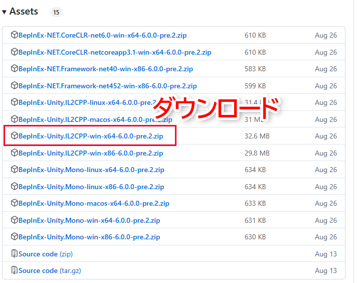
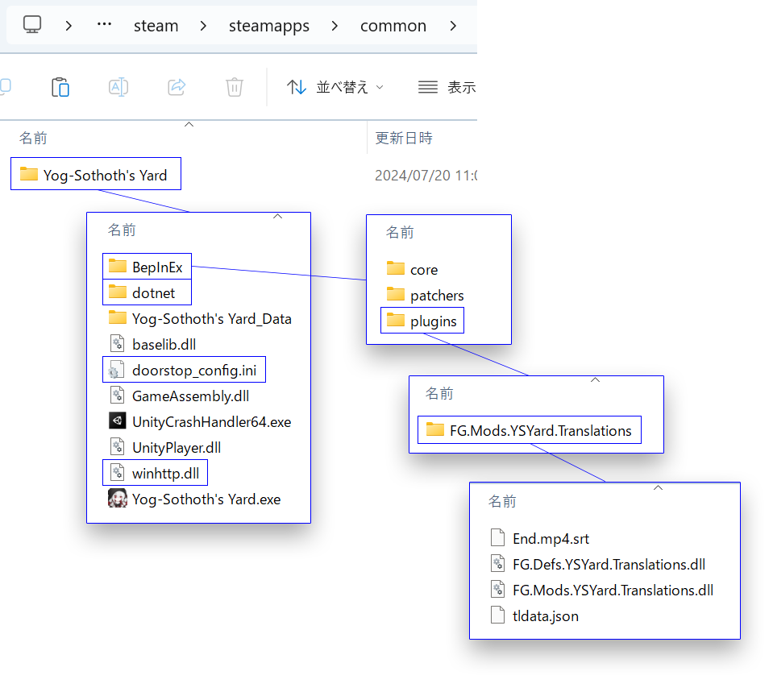
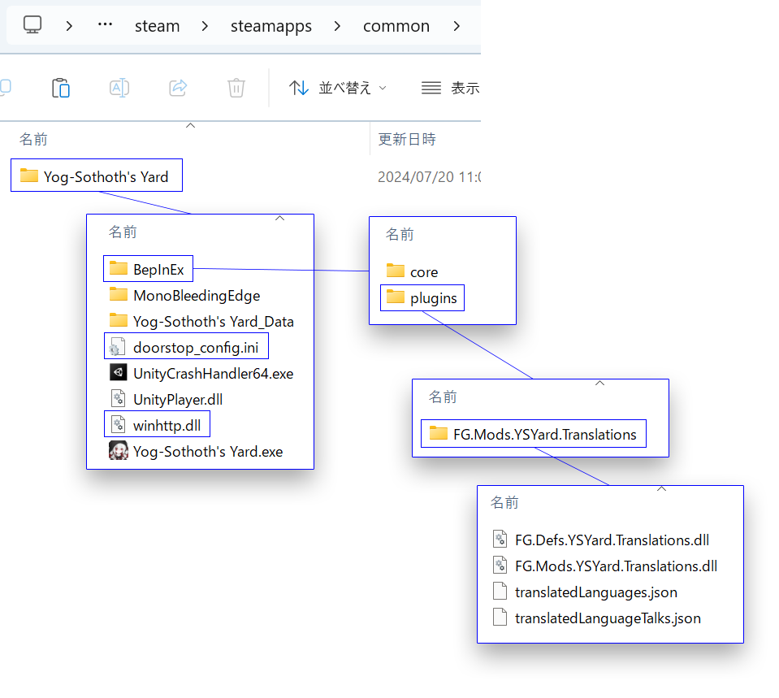
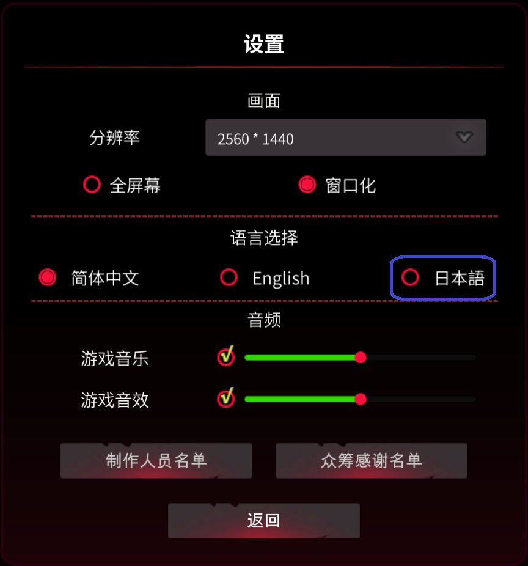

# [Yog-Sothoth's Yard Unofficial Japanese Translation Mod](https://github.com/fronsglaciei/ysytrans/releases)

**Yog-Sothoth's Yard**の非公式日本語化MODを公開するリポジトリです.

Unity汎用Moddingフレームワークの**BepInEx**のプラグインとして作成しています.

## 動作環境

当MODの最新版は以下の環境で作成および動作確認しています.

* Yog-Sothoth's Yard - steam v1.0.11
* BepInEx IL2CPP 6.0.0 build 692
* Windows 11

当MOD v1.0.2の動作環境

<ul>
  <li>"Yog-Sothoth's Yard - steam 2024/06/28版"</li>
  <li>"BepInEx 5.4.23.2"</li>
  <li>"Windows 11"</li>
</ul>

## MOD導入

以下の手順に従って導入してください.

#### 1.BepInExの導入

[BepInEx](https://builds.bepinex.dev/projects/bepinex_be)のIL2CPP Windows 64bit版`BepInEx-Unity.IL2CPP-win-x64-6.0.0-be.692+851521c.zip`をダウンロードして展開の後, 以下のようなディレクトリ階層に配置してください.

* Yog-Sothoth's Yardインストール先(Steam)\steamapps\common\Yog-Sothoth's Yard等
  * Yog-Sothoth's Yard.exe等の公式ファイル
  * **winhttp.dll**
  * **doorstop_config.ini**
  * **dotnet**
  * **BepInEx**

⚠ 注意 ⚠
Program Files以下など管理者権限が必要なディレクトリにインストールされている場合の動作は確認していません.

#### 2.当MODの導入

[Releases](https://github.com/fronsglaciei/YSYMod.Translations/releases)から最新の`FG.Mods.YSYard.Translations.zip`をダウンロードして展開の後, 以下のようなディレクトリ階層に配置してください.

* Yog-Sothoth's Yardインストール先(Steam)\steamapps\common\Yog-Sothoth's Yard等
  * Yog-Sothoth's Yard.exe等の公式ファイル
  * winhttp.dll
  * doorstop_config.ini
  * dotnet
  * BepInEx
    * core等のBepInEx公式フォルダ
    * **plugins**
      * **FG.Mods.YSYard.Translations**
        * **FG.Defs.YSYard.Translations.dll**
        * **FG.Mods.YSYard.Translations.dll**
        * **translatedLanguages.json**
        * **translatedLanguageTalks.json**

当MOD v1.0.2の導入手順

<h4 id="1bepinexの導入-1">1.BepInExの導入</h4>

  <a href="https://github.com/BepInEx/BepInEx/releases">BepInEx</a>のWindows 64bit版<code class="language-plaintext highlighter-rouge">BepInEx_win_x64_5.4.23.2.zip</code>をダウンロードして展開の後, 以下のようなディレクトリ階層に配置してください.

<ul>
  <li>Yog-Sothoth’s Yardインストール先(Steam)\steamapps\common\Yog-Sothoth’s Yard等
    <ul>
      <li>Yog-Sothoth’s Yard.exe等の公式ファイル</li>
      <li><strong>winhttp.dll</strong></li>
      <li><strong>doorstop_config.ini</strong></li>
      <li><strong>BepInEx</strong></li>
    </ul>
  </li>
</ul>

⚠ 注意 ⚠
Program Files以下など管理者権限が必要なディレクトリにインストールされている場合の動作は確認していません.

<h4 id="2当modの導入">2.当MODの導入</h4>

<a href="https://github.com/fronsglaciei/YSYMod.Translations/releases">Releases</a>からv1.0.2の<code class="language-plaintext highlighter-rouge">FG.Mods.YSYard.Translations.zip</code>をダウンロードして展開の後, 以下のようなディレクトリ階層に配置してください.

<ul>
  <li>Yog-Sothoth’s Yardインストール先(Steam)\steamapps\common\Yog-Sothoth’s Yard等
    <ul>
      <li>Yog-Sothoth’s Yard.exe等の公式ファイル</li>
      <li>winhttp.dll</li>
      <li>doorstop_config.ini</li>
      <li>BepInEx
        <ul>
          <li>core等のBepInEx公式フォルダ</li>
          <li><strong>plugins</strong>
            <ul>
              <li><strong>FG.Mods.YSYard.Translations</strong>
                <ul>
                  <li><strong>FG.Defs.YSYard.Translations.dll</strong></li>
                  <li><strong>FG.Mods.YSYard.Translations.dll</strong></li>
                  <li><strong>translatedLanguages.json</strong></li>
                  <li><strong>translatedLanguageTalks.json</strong></li>
                </ul>
              </li>
            </ul>
          </li>
        </ul>
      </li>
    </ul>
  </li>
</ul>

導入するバージョンの選び方

ゲーム本体のバージョンが最新の場合, 当MOD<a href="#1bepinexの導入">最新版の導入手順</a>に従ってください.

ゲーム本体のバージョンがわからない場合, インストールされたディレクトリの構成を確認し, <code class="language-plaintext highlighter-rouge">GameAssembly.dll</code>が<code class="language-plaintext highlighter-rouge">Yog-Sothoth's Yard.exe</code>と同じ階層に存在する場合は, 当MOD<a href="#1bepinexの導入">最新版の導入手順</a>に従ってください. 存在しない場合, 当MOD<a href="#1bepinexの導入-1">v1.0.2の導入手順</a>に従ってください.

## MOD使用

MODの導入に成功すると, ゲーム内設定画面で日本語が選択可能になります.

⚠ 注意 ⚠

* IL2CPP版のBepInExは初回起動に少し時間がかかります. ゲームのスタート画面が表示されるまでお待ちください.
* BepInExのバージョンによってはログ出力用のコンソールウィンドウが同時に起動することがあります. 起動したくない場合は`BepInEx\config\BepInEx.cfg`を編集し`Logging.Console`セクション
で`Enabled = false`に設定してください.

## MOD削除

以下の手順に従って削除してください.

1. ゲーム内設定画面で中国語か英語を選択して終了
2. MOD導入の際に追加した全ファイルを削除

手順1を忘れてファイルを削除してしまった場合も同様に, ゲーム内設定画面で中国語か英語を選択してゲームを終了してください.

## 注意

当MODの使用は自己責任でお願いします.
