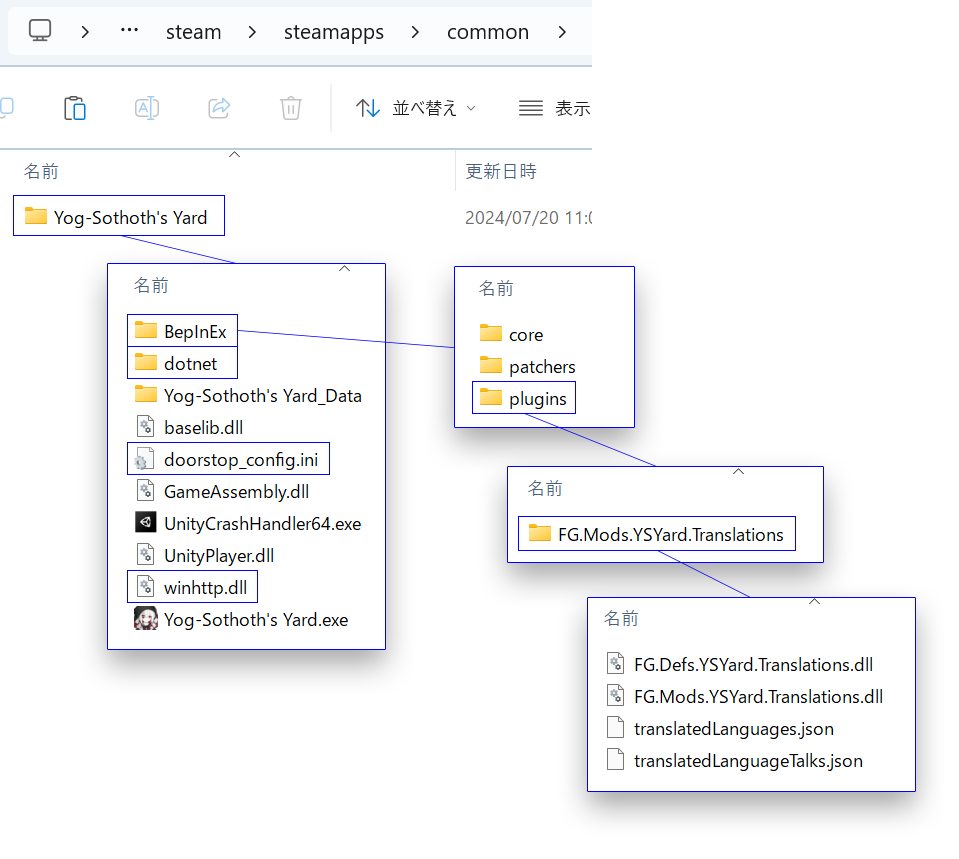

# [Yog-Sothoth's Yard Unofficial Japanese Translation Mod](https://github.com/fronsglaciei/ysytrans/releases)

**Yog-Sothoth's Yard**の非公式日本語化MODを公開するリポジトリです.

Unity汎用Moddingフレームワークの**BepInEx**のプラグインとして作成しています.

## 動作環境

当MODの最新版は以下の環境で作成および動作確認しています.

* Yog-Sothoth's Yard - steam 2nd Anniversary Update(+ hotfix 25/10/27)
* BepInEx IL2CPP 6.0.0-pre.2
* Windows 11

## MOD導入

以下の手順に従って導入してください.

#### 1.BepInExの導入

[BepInEx](https://github.com/BepInEx/BepInEx/releases)のIL2CPP Windows 64bit版`BepInEx-Unity.IL2CPP-win-x64-6.0.0-pre.2.zip`をダウンロードして展開の後, 以下のようなディレクトリ階層に配置してください.

* Yog-Sothoth's Yardインストール先(Steam)\steamapps\common\Yog-Sothoth's Yard等
  * Yog-Sothoth's Yard.exe等の公式ファイル
  * **winhttp.dll**
  * **doorstop_config.ini**
  * **dotnet**
  * **BepInEx**

⚠ 注意 ⚠
Program Files以下など管理者権限が必要なディレクトリにインストールされている場合の動作は確認していません.

#### 2.当MODの導入

[Releases](https://github.com/fronsglaciei/ysytrans/releases)から最新の`FG.Mods.YSYard.Translations.zip`をダウンロードして展開の後, 以下のようなディレクトリ階層に配置してください.

* Yog-Sothoth's Yardインストール先(Steam)\steamapps\common\Yog-Sothoth's Yard等
  * Yog-Sothoth's Yard.exe等の公式ファイル
  * winhttp.dll
  * doorstop_config.ini
  * dotnet
  * BepInEx
    * core等のBepInEx公式フォルダ
    * **plugins**
      * **FG.Mods.YSYard.Translations**
        * **End.mp4.srt**
        * **FG.Defs.YSYard.Translations.dll**
        * **FG.Mods.YSYard.Translations.dll**
        * **tldata.json**

## MOD使用

MODの導入に成功すると, ゲーム内設定画面で日本語が選択可能になります.

⚠ 注意 ⚠

* IL2CPP版のBepInExは初回起動に少し時間がかかります. ゲームのスタート画面が表示されるまでお待ちください.
* BepInExのバージョンによってはログ出力用のコンソールウィンドウが同時に起動することがあります. 起動したくない場合は`BepInEx\config\BepInEx.cfg`を編集し`Logging.Console`セクション
で`Enabled = false`に設定してください.

## MOD削除

MODを削除する場合は, 導入の際に追加した全ファイルを削除してください.

ゲームが正常に終了されなかった場合, 日本語選択状態が保存されたままになってしまう可能性があります. この状態では, 公式の仮置き日本語テキストが表示されてしまいます.

当該の症状が発生している場合は, 設定画面で**英語**を選択すると, 正常なゲーム状態に戻ります.

## 注意

当MODの使用は自己責任でお願いします.
